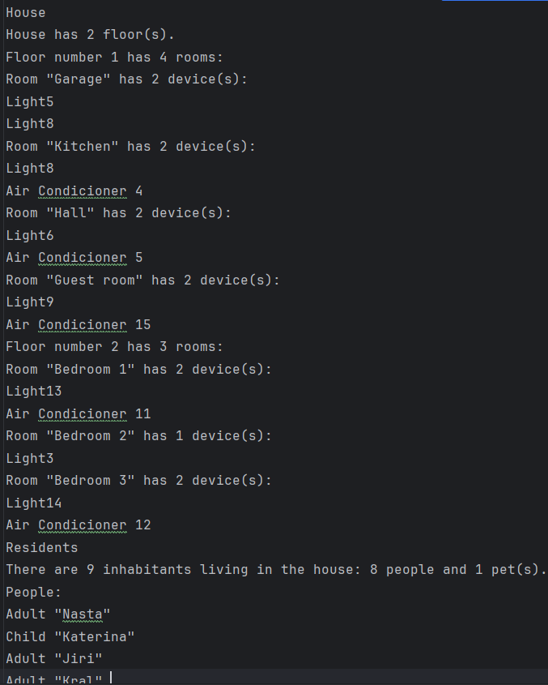
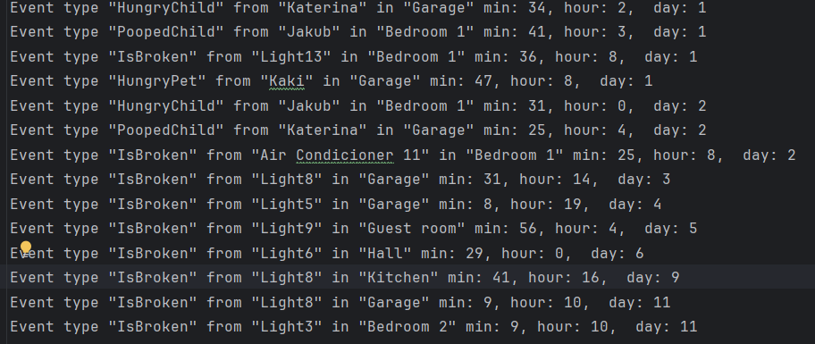
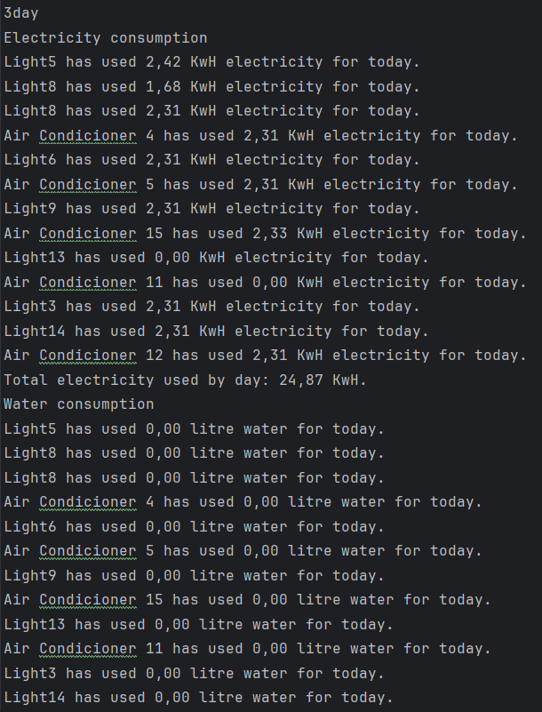
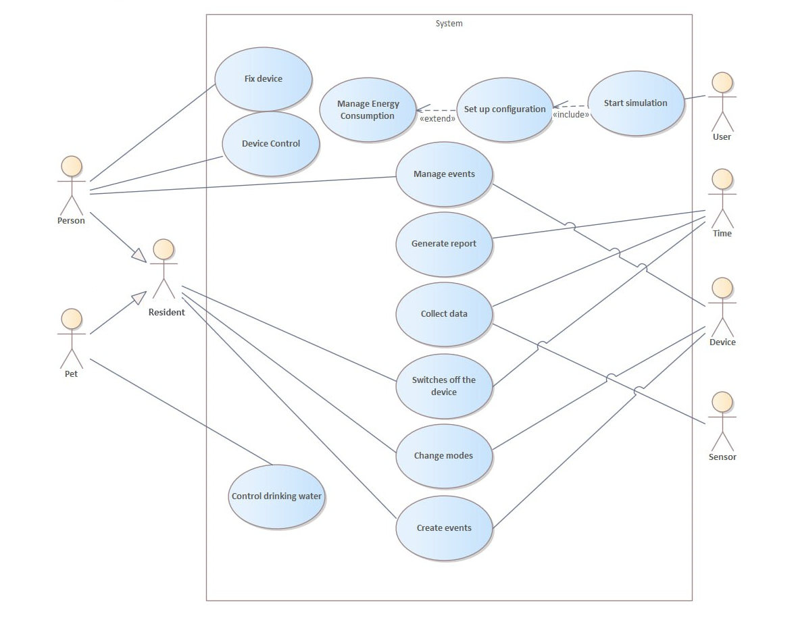
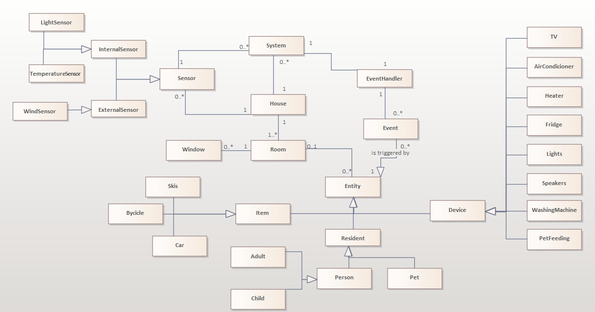

# Smart Home Simulation

## 📌 Description

This project is a Smart Home simulation developed using various design patterns. The simulation models household activities, device usage, energy consumption, and interactions between residents, pets, and appliances.

## 🚀 Features

- 🏠 **Simulated home environment**: House, rooms, floors, sensors, appliances, residents, vehicles, and pets.

- ⚡ **Energy consumption tracking**: Devices record energy, gas, and water consumption.

- ⚙️ **Event-driven system**: Randomly generated events trigger appropriate responses from residents or devices.

- 📊 **Activity logging**: Tracks activities and usage patterns of residents and pets.

- 📑 **Reports generation**: Configuration reports, event logs, usage reports, and consumption reports.

- 🛠 **Error handling**: Devices break over time and require repair or replacement.

## 🏗 Implemented Design Patterns

- **Chain of Responsibility**: Events are processed using handlers.

- **Observer**: Time-dependent entities are monitored by a time component.

- **Builder**: Used for setting up the home configuration.

- **Factory Method**: Creates devices, appliances, and residents in collaboration with the builder.

- **Abstract Factory**: Generates different sensor types (internal and external, though external sensors are not yet implemented).

- **Proxy**: Adds a control layer for simulation start-up.

- **Singleton**: Manages core system state and controls.

- **State Machine**: Represents different states of residents and devices.

## 📂 Reports & Logs

The system generates multiple reports:

🏠 **HouseConfigurationReport** – Shows home configuration hierarchy and residents.

⚠️ **EventReport** – Groups events by type, source, and handlers.

🏃 **ActivityAndUsageReport** – Logs resident and pet activities and device usage.

💰 **ConsumptionReport** – Tracks resource usage (electricity, gas, water) with cost estimates.

## 📌 Simulation logs

.png)
.png)
.png)
.png)

## 📌 Use Case diagram

## 📌 Initial UML diagram

## 📌 Implemented UML diagram

## ▶️ How to Run

1. **Clone the repository**  
   Clone the repository to your local machine using **IntelliJ IDEA**:
   - Go to **File** → **New** → **Project from Version Control**, and paste the repository link: `https://github.com/voropali1/smart_home.git`.

2. **Run the project**  
   To run the project:
   - In **IntelliJ IDEA**, find the **Main** class, then click the **Run** button.

3. **View logs and reports**  
   - **Logs** will be displayed in the **Run** panel at the bottom of the IntelliJ IDEA window.
   - **Reports** can be found in the `smart_home` folder, located at the bottom of your project directory.

## 📌 Future Improvements

✅ Implement external sensors

✅ Improve the graphical representation of reports

✅ Add more device types and improve device integration

### Developed with ❤️ by Alina Voropaeva

